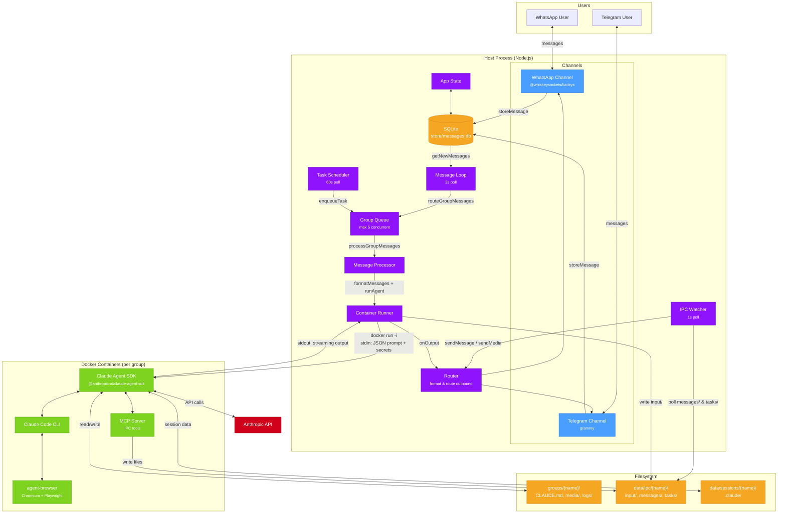
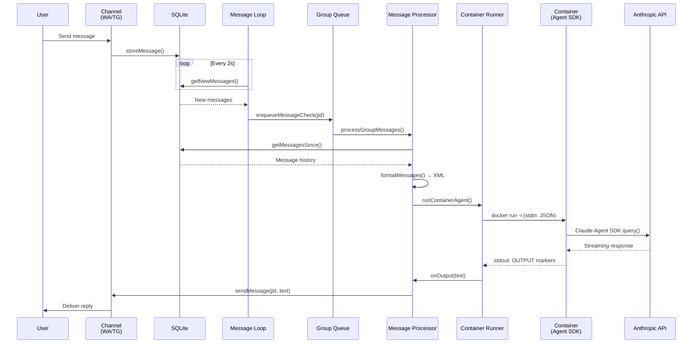
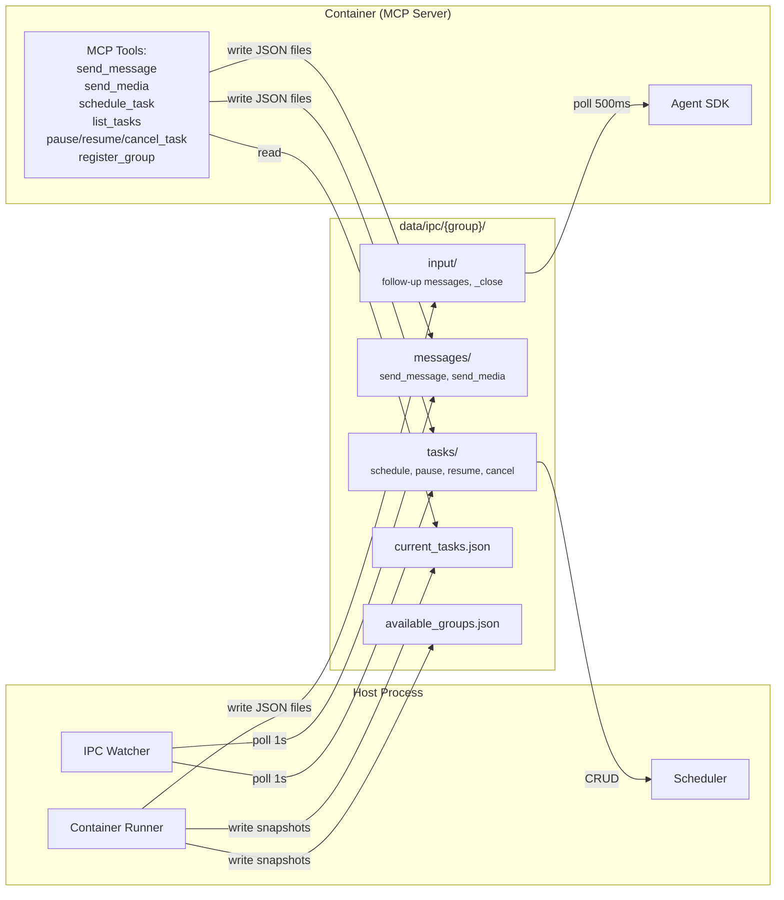
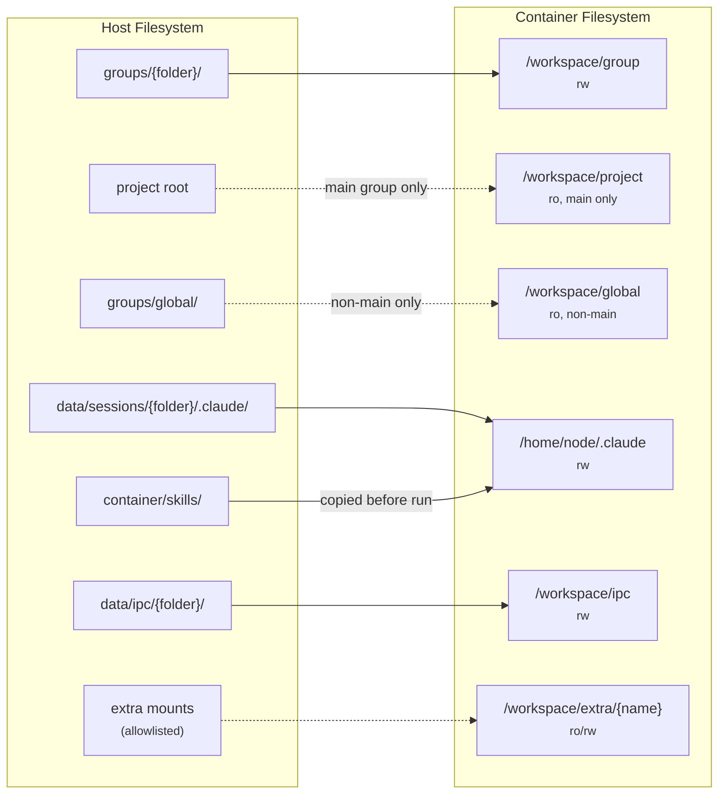
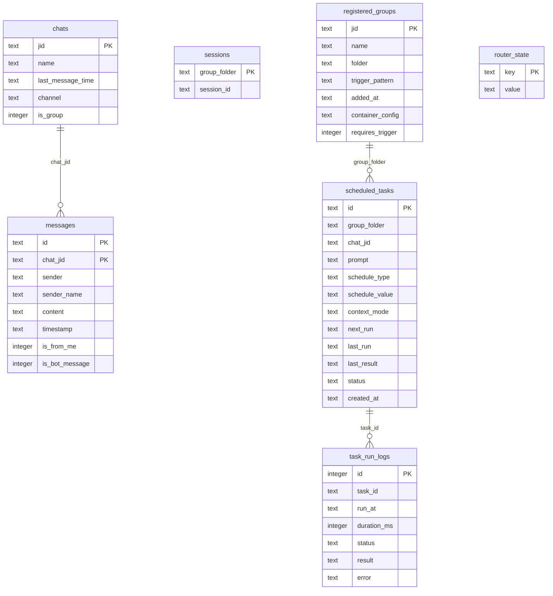
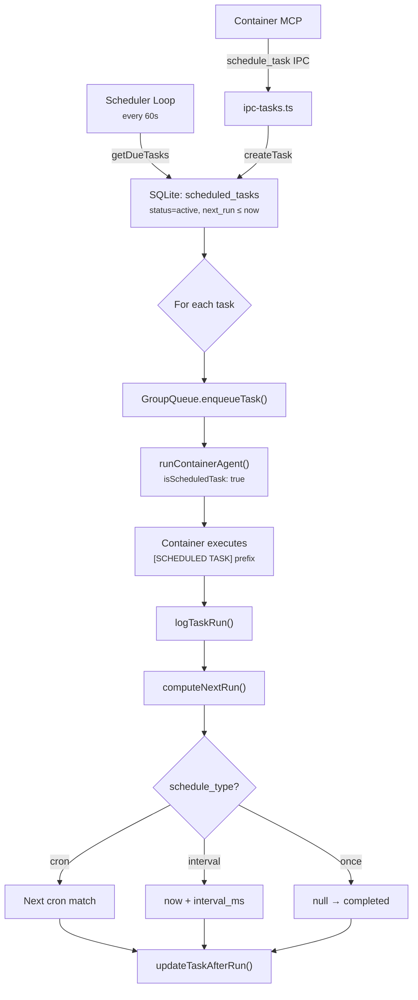
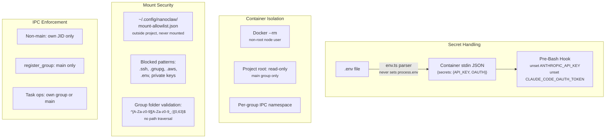
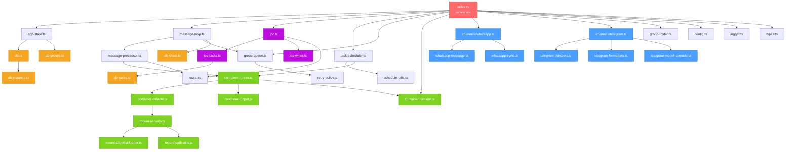

# NanoClaw Architecture

## System Overview

## Message Flow

## IPC Communication

## Container Mounts

## Database Schema

## Task Scheduling

## Security Model

## Module Dependency Graph

